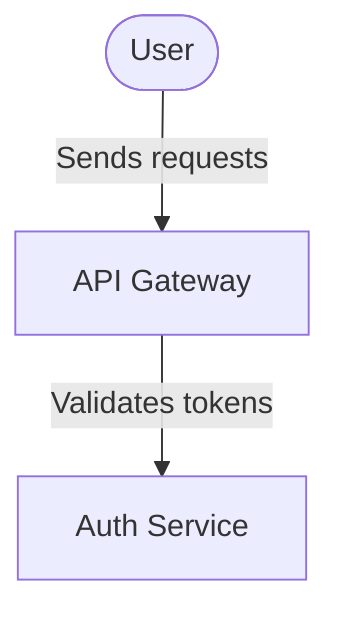

# OPSYDYN Visual Language (OVL)

**A Living, Metrics-Driven Architecture Visualization System**

> Transform static diagrams into dynamic, intelligent blueprints that visualize your system's behavior in real-time.

---

## Overview

The **OPSYDYN Visual Language (OVL)** is an advanced visual notation system for software architecture that combines the structural clarity of C4 and Domain-Driven Design (DDD) with dynamic, data-driven visualizations. Unlike traditional static diagrams, OVL diagrams are **living blueprints** that communicate not just structure, but behavior, performance, and operational characteristics.

### Core Philosophy

**"Architecture that breathes, systems that speak"**

Traditional architecture diagrams are frozen snapshots. OVL diagrams are living entities that:
- **Flow** - Animated data streams show real-time communication patterns
- **Pulse** - Visual indicators communicate system health and activity
- **Scale** - Visual weight reflects operational importance and traffic volume
- **Adapt** - Colors, styles, and animations convey protocol, pattern, and performance

---

## Visual Elements

### 1. Nodes (Components & Entities)

OVL supports two complementary modeling approaches:

#### C4 Architecture Nodes
Strategic system modeling from multiple perspectives:

- **Person** 👤 - Users, actors, and external agents
- **System** 📦 - Software systems and major components
- **External System** 🔗 - Third-party or external dependencies
- **Container** 🗂️ - Deployable units (apps, services, databases)
- **Component** ⚙️ - Code-level components within containers

#### DDD (Domain-Driven Design) Nodes
Tactical domain modeling for complex business logic:

**Strategic Layer:**
- **Bounded Context** 🏛️ - Strategic domain boundaries
- **Aggregate** 🎯 - Consistency boundaries and transaction scopes
- **Domain Event** ⚡ - Significant domain occurrences

**Tactical Layer:**
- **Entity** 🔵 - Objects with unique identity
- **Value Object** 💎 - Immutable descriptive objects
- **Domain Service** 🛠️ - Domain logic that doesn't belong to entities
- **Repository** 💾 - Aggregate persistence abstractions
- **Factory** 🏭 - Complex object creation

**Application Layer:**
- **Command** 📝 - State-changing operations
- **Query** 🔍 - Data retrieval operations
- **Application Service** 🎛️ - Application workflow coordination

**Infrastructure Layer:**
- **Integration Event** 📡 - Cross-boundary event notifications
- **Anti-Corruption Layer (ACL)** 🛡️ - Translation layer for external systems
- **Saga** 🔄 - Long-running distributed transactions

**Node Features:**
- Inline editing (double-click any field)
- Icon customization
- Color-coded by type
- Nested hierarchies for containers
- DDD tactical patterns (subdomains, coupling profiles)

---

### 2. Edges (Relationships & Data Flow)

OVL edges are **intelligent connections** that communicate far more than simple relationships.

#### Visual Encoding System

**Color → Protocol**

Each communication protocol has a distinct color for instant recognition:

| Protocol | Color | Hex | Use Case |
|----------|-------|-----|----------|
| **HTTP** | Green | `#4CAF50` | RESTful APIs |
| **HTTPS** | Dark Green | `#2E7D32` | Secure REST |
| **gRPC** | Blue | `#1976D2` | High-performance RPC |
| **GraphQL** | Pink | `#E91E63` | Query APIs |
| **WebSocket** | Purple | `#9C27B0` | Bi-directional streaming |
| **MCP** | Violet | `#7C3AED` | Model Context Protocol (AI agents) |
| **Kafka** | Black | `#000000` | Event streaming |
| **RabbitMQ** | Orange | `#FF6600` | Message queuing |
| **Redis** | Red | `#DC382D` | Caching / Pub-Sub |
| **REST** | Green | `#4CAF50` | RESTful patterns |
| **SOAP** | Gray | `#607D8B` | Legacy web services |
| **TCP** | Brown | `#795548` | Raw TCP connections |
| **UDP** | Amber | `#FF9800` | Datagram protocols |
| **Custom** | Gray | `#9E9E9E` | User-defined protocols |

**Line Style → Communication Pattern**

The line pattern indicates the communication style:

- **Solid Line** (`━━━`) - **Synchronous** - Request-response, blocking calls
- **Dashed Line** (`╌╌╌`) - **Asynchronous** - Event-driven, non-blocking
- **Dotted Line** (`┄┄┄`) - **Optional** - Degraded mode, fallback, or optional dependency

**Line Thickness → Traffic Volume**

Edge thickness scales logarithmically with request volume:

| Request Volume | Thickness | Visual Weight |
|----------------|-----------|---------------|
| 1-10 req/s | 2px | Minimal |
| 10-100 req/s | 3-4px | Light |
| 100-1000 req/s | 5-7px | Medium |
| 1000+ req/s | 8-10px | Heavy |

---

### 3. Animation System

**The signature feature of OVL** - edges come alive with flowing particles and pulsing indicators.

#### Flowing Particles

Particles travel along edge paths to visualize data flow:

- **Color**: Matches the protocol color
- **Count**: Scales with request volume (1-5 particles)
- **Speed**: Configurable or auto-calculated from traffic
- **Stagger**: Particles start at different intervals for smooth flow

**Particle Count by Volume:**

```
Volume < 10 req/s      → 1 particle  (occasional traffic)
Volume 10-100 req/s    → 2 particles (moderate activity)
Volume 100-500 req/s   → 3 particles (high activity)
Volume 500-1000 req/s  → 4 particles (very busy)
Volume > 1000 req/s    → 5 particles (intense traffic!)
```

#### Pulsing Arrow

A pulsing circle at the edge midpoint reinforces directionality:

- Pulses between 4-7px radius
- Opacity fades between 30-80%
- Pulse duration = 2x animation speed (subtle effect)

#### Animation Speeds

| Speed | Duration | Use Case |
|-------|----------|----------|
| **None** | - | Static diagrams |
| **Slow** | 3000ms | Low-frequency background jobs |
| **Medium** | 1500ms | Standard API traffic |
| **Fast** | 750ms | High-throughput services |
| **Auto** ⭐ | Variable | Automatically adjusts to request volume |

**Auto-Speed Calculation:**

```typescript
Volume < 10 req/s      → Slow (3000ms)
Volume 10-100 req/s    → Medium (1500ms)
Volume 100-1000 req/s  → Fast (750ms)
Volume > 1000 req/s    → Very Fast (500ms)
```

---

## Metadata System

Every edge in OVL can carry rich operational metadata:

### Core Metrics

- **Protocol**: Communication protocol (14 options)
- **Communication Style**: Synchronous / Asynchronous / Optional
- **Request Volume**: Requests per second (affects thickness & particle count)
- **Latency**: Average response time in milliseconds
- **Animation Speed**: Visual flow speed (none / slow / medium / fast / auto)
- **Notes**: Custom annotations

### Visual Encoding Summary

```
Edge Appearance = f(Protocol, Style, Volume, Animation)

Where:
  Color          = PROTOCOL_COLOR_MAP[protocol]
  Line Pattern   = STYLE_MAP[communicationStyle]
  Thickness      = log₁₀(volume) * 2 + 2  (clamped 2-10px)
  Particles      = min(5, ⌈volume / 200⌉)
  Speed          = AUTO_SPEED_MAP[volume]
```

---

## Use Cases & Examples

### 1. Microservices Architecture

**High-Throughput Event Streaming:**
```
Service A ━━━━━━━━━> Service B
  Protocol: Kafka (black)
  Style: Asynchronous (dashed)
  Volume: 1500 req/s
  Animation: Auto (very fast, 500ms)

Visual: Thick black dashed line with 5 fast-moving black particles
```

**Occasional Health Checks:**
```
Service A ━━━━━━━━━> Service B
  Protocol: HTTP (green)
  Style: Synchronous (solid)
  Volume: 5 req/s
  Animation: Auto (slow, 3000ms)

Visual: Thin green solid line with 1 slow-moving green particle
```

### 2. AI Agent Communication

**MCP (Model Context Protocol):**
```
AI Agent ━━━━━━━━━> External Tool
  Protocol: MCP (purple)
  Style: Synchronous (solid)
  Volume: 50 req/s
  Animation: Medium

Visual: Medium purple solid line with 2 purple particles flowing at medium speed
```

### 3. Event-Driven Systems

**Event Bus Pattern:**
```
Publisher ╌╌╌╌╌╌╌> Event Bus ╌╌╌╌╌╌╌> Subscriber
  Protocol: RabbitMQ (orange)
  Style: Asynchronous (dashed)
  Volume: 200 req/s
  Animation: Fast

Visual: Thick orange dashed lines with 3 fast-moving orange particles
```

### 4. Real-Time WebSocket

**Live Data Feed:**
```
Client <━━━━━━━━━> Server
  Protocol: WebSocket (purple)
  Style: Synchronous (solid, bi-directional)
  Volume: 500 req/s
  Animation: Auto (fast, 750ms)

Visual: Thick purple solid line with 4 fast-moving purple particles (both directions)
```

---

## Design Principles

### 1. **Immediate Recognition**
Visual encoding eliminates the need for labels - protocol colors, line styles, and animations communicate intent instantly.

### 2. **Progressive Disclosure**
- **Glance**: Color and animation show protocol and activity
- **Scan**: Line style and thickness reveal patterns and volume
- **Inspect**: Click edges to see detailed metrics and metadata

### 3. **Performance Awareness**
Visual weight (thickness, particle count, speed) directly reflects operational characteristics. Heavy, fast-moving edges demand attention.

### 4. **Living Blueprints**
Unlike static diagrams that decay, OVL diagrams can be updated with real metrics to show actual system behavior, not just intended architecture.

### 5. **Cross-Domain Coherence**
Seamlessly mix C4 (system structure) and DDD (domain logic) modeling in the same diagram. Use the right tool for each level of abstraction.

---

## Interaction Model

### Node Interactions

- **Double-click** any field → Inline editing (label, technology, description)
- **Right-click** node → Context menu (duplicate, change type, delete, add connected node)
- **Drag** → Reposition
- **Select** → Show in properties panel

### Edge Interactions

- **Click** edge → Open metadata editor
- **Right-click** edge → Context menu (edit label, change style, reverse direction, delete)
- **Hover** → Highlight connected nodes

### Canvas Interactions

- **Right-click** canvas → Add node menu (all C4 + DDD types at cursor position)
- **Auto Layout** → Dagre-based hierarchical layout with presets
- **Search** → Filter and navigate to nodes by name
- **Export** → PlantUML C4 or Mermaid with position preservation

---

## Export & Import

### PlantUML C4 Export

```plantuml
@startuml
!include https://raw.githubusercontent.com/plantuml-stdlib/C4-PlantUML/master/C4_Container.puml

Person(user, "User", "End user of the system")
System(api, "API Gateway", "HTTP REST API")
System(service, "Auth Service", "JWT validation")

Rel(user, api, "Sends requests")
' @ovl: protocol=https, style=synchronous, volume=100, latency=50, animation=medium

Rel(api, service, "Validates tokens")
' @ovl: protocol=grpc, style=synchronous, volume=500, latency=10, animation=fast

@enduml
```

**OVL Metadata Format**: Edge metadata is preserved in `@ovl` comments immediately following each relationship. The parser reads these comments on import to restore all edge properties.

### Mermaid Export



**OVL Metadata Format**: Edge metadata is preserved in `@ovl` comments immediately following each relationship. The parser reads these comments on import to restore all edge properties.

**Position Preservation**: Both export formats include viewport metadata and node position comments to restore exact positioning on import.

---

## Color Accessibility

OVL protocol colors are chosen for:
- **Distinction**: High contrast between similar protocols (HTTP green vs gRPC blue)
- **Semantics**: Colors align with common mental models (Kafka = black/Apache, Redis = red/brand)
- **Accessibility**: All colors pass WCAG AA contrast requirements against white backgrounds

---

## Technical Implementation

### Architecture

**Functional Core, Imperative Shell Pattern:**

- **Functional Core** (`src/core/effects/`): Pure functions for edge styling, animation calculation, layout
- **Imperative Shell** (`src/ui/`): React components, XState orchestration, Tauri integration

### Key Technologies

- **ReactFlow**: Node-based canvas with custom edge components
- **SVG Animations**: `<animateMotion>` for particle flow, `<animate>` for pulsing
- **Effect-TS**: Type-safe functional programming for business logic
- **XState**: State machine for UI orchestration
- **Tauri v2**: Native desktop performance with Rust backend

### Performance

- **Lazy Rendering**: Only animated edges use custom components
- **Memoization**: Edge enrichment cached via `useMemo`
- **SVG Optimization**: Hardware-accelerated animations
- **Particle Limits**: Max 5 particles per edge prevents performance degradation

---

## Future Enhancements

From the [Feature Roadmap](FEATURE_ROADMAP.md):

### Planned Features

- **Bi-directional Code Sync**: Generate diagrams from code, update code from diagrams
- **Real-Time Metrics**: Connect to live APM/observability platforms
- **Dependency Visualization**: Show transitive dependencies and blast radius
- **Version Control Integration**: Track diagram evolution alongside code
- **Compliance Overlays**: Visualize security zones, data residency, GDPR boundaries
- **Cost Tracking**: Show AWS/Azure/GCP costs per service
- **Scenario Simulation**: "What if" analysis (traffic spikes, service failures)
- **AI Insights**: Detect anti-patterns, suggest optimizations
- **Deployment Views**: Map logical architecture to physical infrastructure

---

## Contributing

OVL is an open visual language. Contributions welcome:

- **New Protocols**: Add protocol colors to `PROTOCOL_COLOR_MAP`
- **Animation Patterns**: Propose new animation modes or particle behaviors
- **Node Types**: Extend C4 or DDD type systems
- **Export Formats**: Add new export/import formats

---

## License

Part of the OPSYDYN architecture visualization toolkit.

---

## Philosophy

> **"A diagram should not just document what the system is, but reveal how it behaves."**

Traditional architecture diagrams are **prescriptive** - they show intent. OVL diagrams can be **descriptive** - when connected to real metrics, they show reality. The gap between the two is where the most valuable insights emerge.

**OPSYDYN Visual Language**: Where architecture meets operations, and diagrams come alive.

---

*Version 1.0 - Living Architecture for Modern Systems*
