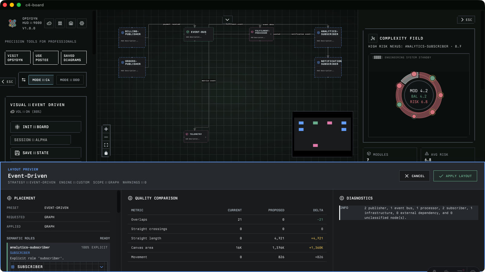
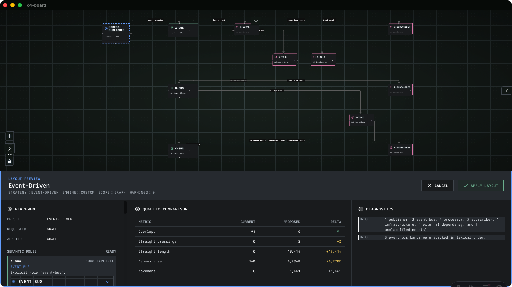

# c4-board

`c4-board` is the OPSYDYN desktop architecture board for modelling C4 systems, exploring ownership and coupling, syncing cloud context, and working with OPY, the board-native architecture agent.

The app is built with Astro, React, Tauri 2, SQLite, Effect, XState, React Flow, Rig, and Bun. It runs as a local-first desktop application with durable board state, OPY sessions, proposal artifacts, checkpoints, and audit/replay telemetry.

## Product Showcase



_Review architecture changes in the native workspace with semantic roles, diagnostics, and non-destructive layout previews._



_Model complex event topologies with deterministic bus bands, explicit processor bridges, and readable subscriber paths._

## Current Status

The current OPY/Rig C4 agentic loop is concluded for this phase. OPY can inspect a board, produce grounded reviews, generate typed C4 mutation proposals, require operator approval, apply safe changes, checkpoint before mutation, roll back, persist resumable task state, and expose audit/eval diagnostics.

Remaining roadmap work is now platform and release-governance focused:

- release gates over existing replay, confidence, anomaly, approval, and eval signals
- provider token/cost persistence and budget UI
- broader tool registry coverage beyond the current C4 loop
- Azure sync hardening and enterprise rollout controls
- session-management polish and platform expansion

## Product Surface

### C4 Board

- Create, edit, save, load, and export C4 diagrams.
- Model `person`, `system`, `external`, `container`, and `component` nodes.
- Add and label relationships between nodes.
- Use graph, selection, and essential architecture layouts.
- Import/export Mermaid and PlantUML C4 formats.
- Export board images.
- Persist diagram state locally in SQLite.

### OPY

OPY is the floating architecture copilot for the board.

- Draggable/resizable floating widget with snap modes and orb controls.
- Slash-command palette for `/diagram`, `/review`, and `/add`.
- Grounded board review with citations, confidence scoring, and diagnostics.
- Typed proposal cards with node/edge diffs before apply.
- Policy-gated apply with confirmation, checkpoints, and rollback.
- Anomaly screening for unsafe or suspicious prompts.
- Resumable task lifecycle with task history, lineage, artifacts, and replay/audit surfaces.

Full handbook: [docs/src/content/docs/opy/index.md](docs/src/content/docs/opy/index.md)

### Settings And Runtime

- Local settings stored through the app settings runtime.
- OpenAI key resolution through keychain-first secure storage with explicit fallback diagnostics.
- Settings mutation lock for high-risk settings actions.
- Database runtime status and SQLite diagnostics.
- Agent audit panel for persisted OPY task/tool/artifact history.

### Postee

The app also includes the Postee workspace for local API/client experimentation:

- request builder
- durable scratch requests that can be sent before creating a collection
- scratch tabs with close and reopen controls, plus atomic save-to-collection promotion
- response viewer
- Monaco JSON editor
- environment support
- history/search
- load-test panel

### Azure And Topology Intelligence

- Azure graph sync for importing live cloud resources into the board.
- Team ownership catalog and ownership lens.
- Balanced coupling and mud-risk scoring model.
- Explainability surfaces for topology review.

Azure sync reads your account through the Azure CLI, so it needs `az login` and the `resource-graph` extension before the panel will return anything:

```sh
az login
az extension add --name resource-graph
```

How to use it: [Azure sync guide](docs/src/content/docs/guides/azure-sync.md)

Roadmap: [docs/src/content/docs/overview/product-roadmap-team-topology-azure-sync.md](docs/src/content/docs/overview/product-roadmap-team-topology-azure-sync.md)

## Tech Stack

- **Runtime**: Tauri 2 desktop shell
- **Frontend**: Astro 6, React 19, React Flow, vanilla-extract
- **State**: Effect, XState, Effect Atom
- **Persistence**: SQLite through Tauri SQL plus direct Rust/sqlx runtime support
- **Agent Runtime**: Rig core with OpenAI provider path
- **Testing**: Vitest, Testing Library, jsdom
- **Package Manager**: Bun
- **Release**: GitHub Actions, release-plz, Tauri bundling

## Prerequisites

Install the standard Tauri prerequisites for your operating system:

- Rust stable toolchain
- Bun
- platform build tools required by Tauri
- Node-compatible shell environment

Tauri prerequisites: <https://v2.tauri.app/start/prerequisites/>

The Azure sync panel additionally needs the **Azure CLI** with the `resource-graph` extension, since the app runs `az graph query` as a subprocess. It is not needed for anything else — see [Azure sync](docs/src/content/docs/guides/azure-sync.md).

## Setup

Install dependencies:

```sh
bun install
```

Run the web app only:

```sh
bun dev
```

Run the desktop app in Tauri dev mode:

```sh
bun tauri dev
```

If Vite reports stale optimized dependencies, reset the dev cache:

```sh
bun run dev:reset
```

## Environment Governance

[ADR-009](docs/src/content/docs/architecture/adr/009-varlock-environment-governance.md) adopts Varlock for development and CI validation without replacing runtime secret storage. The committed [.env.schema](.env.schema) contains metadata and optional defaults only; never add a real credential to it.

For local environment overrides, use an ignored `.env.local` file. OPY credentials should normally be entered through `Settings > AI Agent`, which keeps the OS keychain first in the resolution order.

```sh
bun run env:check
bun run env:scan
bun run env:scan:build
bun run env:scan:staged
```

`env:check` validates resolved values against the schema. The scan commands look for the exact values of sensitive variables Varlock can resolve in the current environment; when no sensitive value is configured, Varlock has no value to scan for. They are not generic credential-pattern or entropy scanners.

CI and release builds set a non-secret sentinel as a sensitive OPY value, build the frontend, and scan `dist`. This makes the build-output gate fail if a provider variable is accidentally bundled without exposing a real credential. Manually rebuilt tags created before ADR-009 skip these Varlock steps because their dependency graph has no schema or CLI.

## Common Scripts

```sh
bun run build
bun run env:check
bun run env:scan
bun run env:scan:build
bun run env:scan:staged
bun run astro check
bun run lint
bun run lint:fix
bun run test
bun run test:run
bun run test:coverage
bun run knip
bun run docs:dev
bun run docs:build
bun run docs:check
bun tauri build
```

Release-plz surface generation:

```sh
bun run release:surface
```

## OPY Setup

Open `Settings` and configure the OpenAI API key in the AI Agent section. The app resolves secrets in this priority order:

1. OS keychain
2. settings database fallback
3. environment fallback, where supported

The UI only reports key presence and source; it should not render raw secret values in logs, telemetry, or diagnostics.

## Testing

Run the full Vitest suite:

```sh
bun run test:run
```

Run focused suites:

```sh
bun run test:run test/core/effects/agent-policy.test.ts
bun run test:run test/core/effects/opy-action.runtime.test.ts
bun run test:run test/core/effects/agent-evals/rig-agent.evals.test.ts
```

Run Astro type/content checks:

```sh
bun run astro check
```

Testing conventions: [tests/README.md](tests/README.md)

## Build And Release

Build the frontend:

```sh
bun run build
```

Build desktop bundles:

```sh
bun tauri build
```

Release automation is managed through GitHub Actions and release-plz. The Rust crate metadata lives in [src-tauri/Cargo.toml](src-tauri/Cargo.toml), release-plz config lives in [src-tauri/release-plz.toml](src-tauri/release-plz.toml), and the release surface is generated by [.github/scripts/prepare-release-plz-surface.ts](.github/scripts/prepare-release-plz-surface.ts).

Release install notes: [docs/src/content/docs/guides/release-installation.md](docs/src/content/docs/guides/release-installation.md)

Apple signing and notarization notes: [.github/apple-signing.md](.github/apple-signing.md)

## macOS Gatekeeper Workaround

Releases are signed with a Developer ID certificate, but Apple's notarization service has been unreliable for us, and a build without a stapled ticket is refused by Gatekeeper with "developer cannot be verified". The same applies to local unsigned builds.

Download `darwin_aarch64` for Apple Silicon, `darwin_x64` for Intel.

macOS flags the downloaded `.dmg`, so clear that first — you are blocked before you can copy anything into `/Applications`:

```sh
xattr -d com.apple.quarantine ~/Downloads/c4-board_<version>_darwin_aarch64.dmg
```

Then, after dragging the app across:

```sh
xattr -cr /Applications/c4-board.app
open /Applications/c4-board.app
```

To check whether you actually need this — `source=Notarized Developer ID` in the output means you do not:

```sh
spctl -a -vvv /Applications/c4-board.app
```

Full notes, including the `xattr -r` fallback and why macOS assets sometimes vanish from a release: [docs/src/content/docs/guides/release-installation.md](docs/src/content/docs/guides/release-installation.md)

This is a stopgap. Delete it once notarization is reliable.

## Documentation Map

The canonical documentation source lives in the standalone Starlight app under `docs/src/content/docs`.

```sh
bun run docs:dev
bun run docs:build
bun run docs:check
```

- [Docs landing page](docs/src/content/docs/index.md)
- [OPY handbook](docs/src/content/docs/opy/index.md)
- [Rig agent task breakdown](docs/src/content/docs/opy/rig-agent-task-breakdown.md)
- [Rig hello-world boundary](docs/src/content/docs/opy/rig-agent-hello-world.md)
- [Product roadmap](docs/src/content/docs/overview/product-roadmap-team-topology-azure-sync.md)
- [Release installation](docs/src/content/docs/guides/release-installation.md)
- [Azure sync](docs/src/content/docs/guides/azure-sync.md)
- [ADR index](docs/src/content/docs/architecture/adr/index.md)
- [Context menu implementation](docs/src/content/docs/guides/context-menu-implementation.md)
- [Postmortem: OPY board interaction regression](docs/src/content/docs/postmortems/2026-06-05-opy-native-board-interaction-regression.md)

## Repository Layout

```text
src/
  pages/                  Astro routes
  ui/components/          React UI surfaces, C4 board, OPY, Postee, settings
  ui/machines/            XState machines
  core/effects/           Effect runtimes, persistence, OPY agent, Azure sync
  core/schema/            C4 and diagram schemas
src-tauri/
  src/                    Rust Tauri commands, DB, AI agent bridge, Azure sync
  migrations/             SQLite migrations
docs/                     Standalone Starlight docs app and canonical markdown source
test/                     Vitest suites and fixtures
.github/                  CI, release, signing, release-plz scripts
```

## Engineering Notes

- Keep OPY mutations behind typed proposal/action descriptors and policy decisions.
- Do not bypass confirmation for batch mutation, rollback, settings mutation, or anomaly-blocked plans.
- Keep database writes foreign-key safe by persisting task envelopes before related tool calls or artifacts.
- Keep React Flow viewport ownership independent from OPY resize/position effects.
- Prefer focused regression tests for every bug fix, especially lifecycle, persistence, and agent-policy changes.
